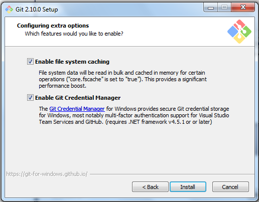
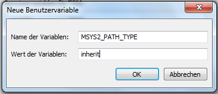
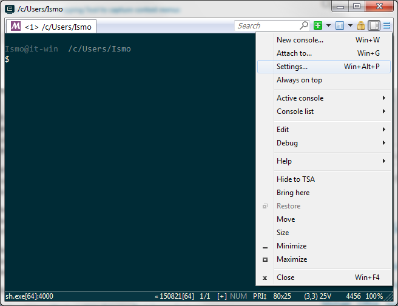
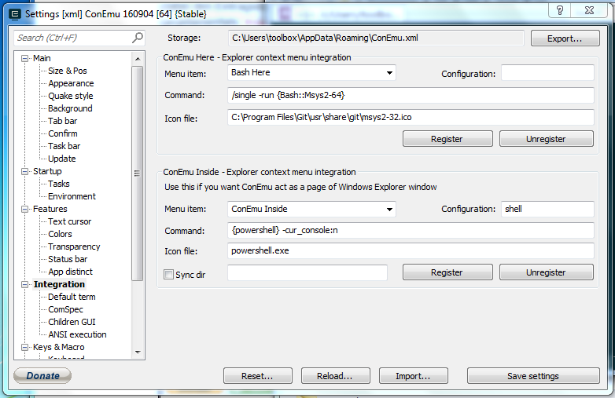

Wir empfehlen die Installation einer 64-bit Version, falls man ein 64-bit Betriebssystem benutzt.
Wenn man sich nicht sicher ist, hat man heutzutage fast immer 64-bit.

Für OS X und Linux sind Konsole und Terminal gleichbedeutend, für Windows nicht.

__Es müssen alle Schritte (Installieren, Testen, Aktualisieren) ausgeführt werden!__

Falls man nicht am LaTeX-Kurs teilnimmt, ist TeXLive/MacTeX optional.
Dann kann man allerdings kein TeX in matplotlib benutzen (führt zu weniger schönen Plots).

Falls man nur am LaTeX-Kurs teilnehmen will, sollte man mindestens Sumatra und Atom (oder einen anderen Texteditor) und TeXLive/MacTeX installieren.
Dann ist mit Terminal die Windows-Konsole gemeint (wenig bequem).

<div class="row" style="padding: 10px">
  <div class="col-md-4" align="center">
  <a href="#windows" class="btn btn-primary btn-lg btn-block" role="button">
  Windows
  </a>
  </div>
  <div class="col-md-4" align="center">
  <a href="#mac" class="btn btn-primary btn-lg btn-block" role="button">
  MacOS
  </a>
  </div>
  <div class="col-md-4" align="center">
  <a href="#linux" class="btn btn-primary btn-lg btn-block" role="button">
  Linux
  </a>
  </div>
</div>
<div class="row" style="padding: 10px">
  <div class="col-md-1" align="center"></div>
  <div class="col-md-4" align="center">
  <a href="#test" class="btn btn-primary btn-lg btn-block" role="button">
  Testen
  </a>
  </div>
  <div class="col-md-2" align="center"></div>
  <div class="col-md-4" align="center">
  <a href="#update" class="btn btn-primary btn-lg btn-block" role="button">
  Aktualisieren 
  </a>
  </div>
  <div class="col-md-1" align="center"></div>
</div>

## <a id="windows"></a>Windows

Findet heraus, ob ihr ein 64- oder 32-bit Betriebssystem habt. Das geht mit Rechtsklick 
auf `Computer` (Windows 7) bzw. `Dieser PC` (Windows 10) und dann Eigenschaften.

Getestet auf Windows 7, funktioniert wahrscheinlich auch für 8 und 10.

<span style="font-size: large;">[Dateiendungen einschalten!](https://support.microsoft.com/kb/865219/de)</span>

### Sumatra PDF

- [Sumatra](http://www.sumatrapdfreader.org/download-free-pdf-viewer.html): PDF-Betrachter

Für 64-Bit Systeme die Datei unter `64-bit builds` herunterladen!

Die Verwendung von Acrobat Reader wird nicht empfohlen, da er die PDF-Datei blockiert, sodass sie nicht von TeX überschrieben werden kann (warum das wichtig ist, erfährt man im Kurs).

Unter Options kann er als Standard-Programm für PDFs eingestellt werden:  


### Atom

- [Atom](https://atom.io/): Texteditor
- Um Probleme mit dem deutschen Tastaturlayout zu vermeiden, muss noch das Plugin 'keyboard-localization' installiert werden
    - Klicke auf `File → Settings`
    - Wähle `Install` in der Leiste aus
    - Suche nach dem Paket `keyboard-localization`
    - Installiere es mit einem Klick auf `Install`
- Damit Atom LaTeX-Code besser darstellen kann muss das Plugin 'language-latex' installiert werden
    - Dazu wie oben verfahren

### Anaconda

- [Anaconda](http://www.continuum.io/downloads#windows): Python und Bibliotheken

__Wichtig__: Wir wollen Python 3.5 (oben). Richtige Version (32-bit / 64-bit) auswählen.

Die Standardeinstellung ist ok:  


Der Standardpfad ist ok:  


So ist die Verwendung am bequemsten (auch die Standardeinstellungen):  


### ConEmu

- [ConEmu](https://github.com/Maximus5/ConEmu/releases): Mächtiger Ersatz für die Windows-Konsole

Richtig ist die Datei `ConEmuSetup.*.exe`.

Hier `x64` für 64-bit oder `x86` für 32-bit auswählen:  


Die Standardeinstellungen sind ok:  


Einmal ConEmu (vom Desktop oder aus dem Startmenü) starten und die Standardeinstellungen absegnen:  


### Git

- [Git](http://git-scm.com/download/win): Versionskontrolle

Der Standardpfad ist ok:  


Hier "Git Bash Here" und "Associate .sh files to be run with Bash" abwählen:  


So ist git bequem nutzbar:  


Das ist besonders wichtig, falls man mit anderen zusammenarbeitet, die OS X oder Linux verwenden:  


Damit Python auch funktioniert:  


Auch hier die Standardeinstellungen übernehmen und auf `install` klicken:


### Unix-Kommandozeilentools und Make

- [MSys2](https://msys2.github.io/): Unix-Kommandozeilentools und Make

`x86_64` ist für 64-bit, `i686` für 32-bit.

Der Standardpfad ist ok:  


Das geöffnete schwarze Fenster kann man einfach schließen.

Damit die installierten Programme wie Git und Python gefunden werden, muss noch eine
Umgebungsvariable angelegt werden.
* Rechtsklick auf `Computer` → `Eigenschaften`
* durchklicken: `Erweiterte Systemeinstellungen` → `Umgebungsvariablen`
* Unter `Benutzervariablen` auf `Neu` klicken
* Name: `MSYS2_PATH_TYPE`, Wert: `inherit`



ConEmu starten und über die drei Balken in der rechten oberen Ecke das Einstellungsfenster öffnen:  


Unter `Startup` / `Specified named task` `{Bash::Msys2-*}` (entweder 32 oder 64 statt *) auswählen:  


Unter "Integration" die obere Hälfte in die angezeigte Form bringen und dann "Register" drücken
(dabei den Eintragsnamen angeben, den man im letzten Schritt ausgewählt hat (für 32-bit))
(gegebenenfalls `Program Files` durch `Programme` oder ähnliches ersetzen):  


Mit "Save settings" unten das Fenster schließen und auch das Hauptfenster schließen.

Jetzt sollte über Rechtsklick auf eine leere Stelle des Desktops oder eines Explorer-Fensters der Eintrag "Bash Here" ConEmu öffnen:  


Ab jetzt ist mit Terminal genau das gemeint.

Jetzt kann Make installiert werden.
Zuerst wird der Paketmanager aktualisiert.
Im geöffneten Terminal eingeben (Rechstklick auf das Terminal zum Einfügen von kopiertem Text):

    pacman -Syu

Hilfedateien und Make installieren:

    pacman -S man-db make

Eine Windows-Konsole kann man über ConEmu öffnen:  


### Git-Einstellung

Im Terminal (auf Anführungszeichen achten):

    git config --global core.editor "atom --wait"

### Uncertainties

- [Uncertainties](http://pythonhosted.org/uncertainties/): Python-Bibliothek für automatisierte Fehlerrechnung

Im Terminal eingeben

    pip install uncertainties

### TeXLive

- [TeXLive](https://www.tug.org/texlive/): [Installationsanleitung](https://www.tug.org/texlive/windows.html)
    - [Versionsunabhängiger Link (install-tl-windows.exe)](http://mirror.ctan.org/systems/texlive/tlnet/install-tl-windows.exe)
    - __Achtung__: während des Installationsvorgangs werden ca. 4 GiB Dateien heruntergeladen.
    - Es wird empfohlen, den Virenscanner für die Dauer der Installation abzuschalten, falls es zu Problemen kommt.

Die einfache Installation genügt:  


Der Standardpfad ist ok:  


Wir brauchen TeXworks nicht:  


__Jetzt noch die Installation [testen](#test)!__

## <a id="mac"></a>Mac OS

### Terminal

- Das Terminal ist in jeder OS X Distribution enthalten
- Im Spotlight nach "Terminal" suchen
- Das Programm befindet sich in `Programme/Dienstprogramme/Terminal.app`

### Command Line Tools

Die command line tools beinhalten unter anderem Git und einen C/C++ Compiler.
Zur installation folgendes im Terminal eingeben
```bash
xcode-select --install
```
Danach "Installieren" auswählen und warten. Der Download wiegt etwa 130MB.

### Anaconda

- [Anaconda](http://www.continuum.io/downloads#osx): Python und
  Bibliotheken

__Wichtig__: Wir wollen Python 3.5 Graphical Installer (oben).  Das Paket installieren.

### Atom

- [Atom](https://atom.io/): Texteditor. 'Download for Mac' wählen und die
  Heruntergeladene Datei öffnen. Die `Atom.app` wird dann extrahiert und muss
  nach `Programme` verschoben werden.  Zum Test einmal die App öffnen.

Um git beizubringen, Atom zu benutzen, Im terminal:

```bash
git config --global core.editor "atom --wait"
```

- Damit Atom LaTeX-Code besser darstellen kann muss das Plugin `language-latex`
  installiert werden
    - Dazu in den Einstellungen (Unter `Atom → Preferences`) auf `Install`
      klicken
    - Nach `language-latex` suchen
    - Auf `Install` klicken

### Uncertainties

- [Uncertainties](http://pythonhosted.org/uncertainties/): Python-Bibliothek
  für automatisierte Fehlerrechnung

Im terminal:

    pip install uncertainties

### MacTeX

- [MacTeX](https://tug.org/mactex/): Umfassende LaTeX-Distribution

[MacTeX.pkg](http://tug.org/cgi-bin/mactex-download/MacTeX.pkg) herunterladen
und das Paket installieren.

__Jetzt noch die Installation [testen](#test)!__

## <a id="linux"></a>Linux

### Git und Make

- Debian, Ubuntu, Mint:

        sudo apt-get update
        sudo apt-get install git make

- Fedora:

        sudo yum install git-core make

- OpenSUSE:

        sudo zypper in git make

- Arch Linux:

        sudo pacman -S git make

### Atom

- Debian, Ubuntu, Mint:
  - Download der .deb Datei hier: [http://atom.io](http://atom.io)
  - installieren mit `sudo apt-get install /path/to/atom-amd64.deb`
  - Hinweis: es muss ein absoluter Pfad angegeben werden

- Fedora
  - Download der .rpm Datei hier: [http://atom.io](http://atom.io)
  - installieren mit `rpm -i /path/to/atom.x86_64.rpm`

- Arch Linux:
  - atom gibt es im AUR, Installation mit dem Lieblings-AUR tool
  - z. B. `yaourt -S atom-editor-bin` oder `sudo aura -A atom-editor-bin`

### Anaconda

- [Anaconda](http://www.continuum.io/downloads#linux): Python und Bibliotheken

__Wichtig__: Wir wollen Python 3 (rechte Seite).

Im Terminal:

    bash Anaconda3-*-Linux-*.sh
    <Enter>
    yes
    ~/.local/anaconda3
    yes

Nach der Installation muss man ein neues Terminal öffnen, damit Anaconda gefunden wird.

### Uncertainties

    pip install uncertainties

### TeXLive

- [TeXLive](https://www.tug.org/texlive/): [Installationsanleitung](https://www.tug.org/texlive/quickinstall.html)
    - [Versionsunabhängiger Link (install-tl-unx.tar.gz)](http://mirror.ctan.org/systems/texlive/tlnet/install-tl-unx.tar.gz)
    - __Achtung__ während des Installationsvorgangs werden ca. 4 GiB Dateien heruntergeladen

Im Terminal:

    tar xvzf install-tl-unx.tar.gz
    TEXLIVE_INSTALL_PREFIX=~/.local/texlive install-tl-*/install-tl
    I
    echo export PATH=\"$(echo ~/.local/texlive/*/bin/*):\$PATH\" >> ~/.bashrc

__Jetzt noch die Installation [testen](#test)!__

## <a id="test"></a>Testen

### Git

Im Terminal:

    git

Es sollte die Git-Hilfe erscheinen.

Git einstellen: im Terminal (<span style="color: red;">__Eigene Daten eintragen!!!__</span>):

    git config --global user.name "Max Mustermann"
    git config --global user.email "max.mustermann@udo.edu"
    git config --global pull.rebase true
    git config --global rebase.stat true
    git config --global merge.conflictstyle diff3

### Python

Im Terminal:

    ipython
    %matplotlib
    import matplotlib.pyplot as plt
    plt.plot([1, 2, 4])

Es sollte ein Fenster mit einem Plot erscheinen.

### Uncertainties

Im Terminal:

    ipython
    import uncertainties

Es sollte keine Fehlermeldung erscheinen.

### Make

Im Terminal:

    make

Es sollte folgende Ausgabe erscheinen:

    make: *** No targets specified and no makefile found.  Stop.

### TeX

Im Terminal:

    luatex

Es sollte folgende Ausgabe erscheinen:

    This is LuaTeX, Version beta-0.80.0 (TeX Live 2015) (rev 5238)
     restricted \write18 enabled.
    **

Mit Strg-C beenden.

    biber

Es sollte die Biber-Hilfe erscheinen.

    texdoc texlive

Es sollte die Dokumentation von TeXLive geöffnet werden (in einem PDF-Betrachter).

### TeXLive einstellen: 

<span style="color: red;">Auf Windows:</span> `cmd.exe` oder ein `cmd`-Terminal in ConEmu benutzen

    tlmgr option autobackup -- -1
    tlmgr option repository http://mirror.ctan.org/systems/texlive/tlnet

## <a id="update"></a>Aktualisieren

### Anaconda

Im Terminal (Bash):

    conda update anaconda

### Unix-Tools und Make (Windows)

Im Terminal:

    update-core

Falls Pakete aktualisiert wurden, Terminal neustarten.

    pacman -Su

### Uncertainties

Im Terminal:

    pip install -U uncertainties

### TeXLive

<span style="color: red;">Auf Windows:</span> `cmd.exe` oder ein `cmd`-Terminal in ConEmu benutzen

    tlmgr update --self --all --reinstall-forcibly-removed
