<span style="color: red; font-size: xx-large;">Die Installationsanleitung wurde noch nicht für 2015 aktualisiert.</span>

Wir empfehlen die Installation einer 64-bit Version, falls man ein 64-bit Betriebssystem benutzt.

Für OS X und Linux sind Konsole und Terminal gleichbedeutend, für Windows nicht.

__Es sollten alle Schritte (Installieren, Testen, Aktualisieren) ausgeführt werden!__

Falls man nicht am LaTeX-Kurs teilnimmt, ist TeXLive/MacTeX optional.
Dann kann man allerdings kein TeX in matplotlib benutzen (führt zu weniger schönen Plots).

Falls man nur am LaTeX-Kurs teilnehmen will, sollte man mindestens Notepad++ (oder einen anderen Texteditor) und TeXLive/MacTeX installieren.
Dann ist mit Terminal die Windows-Konsole gemeint (wenig bequem).

1. Installieren
    - [Windows](#windows)
    - [OS X](#osx)
    - [Linux](#linux)
2. [Testen](#test)
3. [Aktualisieren](#update)

## <a id="windows"></a>Windows

Getestet auf Windows 7, funktioniert wahrscheinlich auch für Vista und 8.

<span style="font-size: large;">[Dateiendungen einschalten!](https://support.microsoft.com/kb/865219/de)</span>

<span style="color: red; font-size: xx-large;">Die angegebenen Installationspfade nutzen! (C:\\Toolbox\\…)</span>

Nach jedem Installationsschritt sollte ein neues Terminal geöffnet werden (falls eins gebraucht wird).

### Anaconda

- [Anaconda](http://www.continuum.io/downloads): Python und Bibliotheken
    - [Version 2.0.1, 32-bit](http://repo.continuum.io/anaconda3/Anaconda3-2.0.1-Windows-x86.exe)
    - [Version 2.0.1, 64-bit](http://repo.continuum.io/anaconda3/Anaconda3-2.0.1-Windows-x86_64.exe)

Für alle Nutzer installieren:  
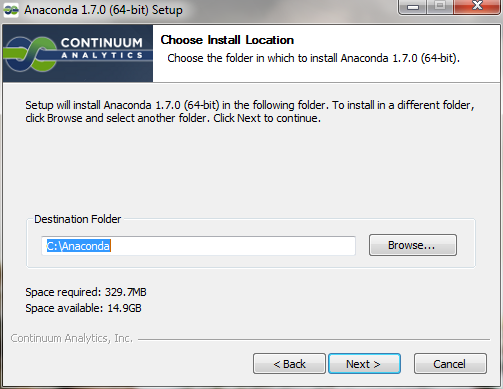

Auf den Pfad achten:  
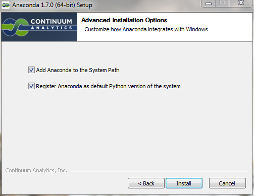

So ist die Verwendung am bequemsten:  


### Notepad++

- [Notepad++](http://notepad-plus-plus.org/download/): Texteditor
    - [Version 6.6.9](http://download.tuxfamily.org/notepadplus/6.6.9/npp.6.6.9.Installer.exe)

Auf den Pfad achten:  
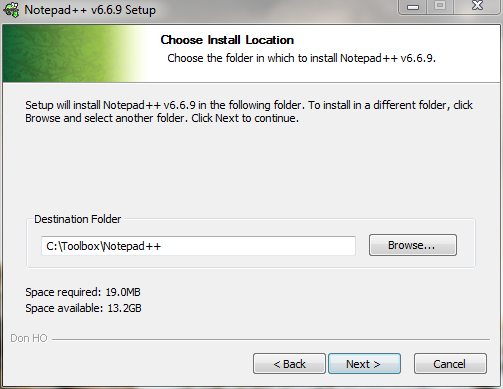

### Git Bash

- [Git Bash](http://git-scm.com/download/win): Versionskontrolle und Unix-Kommandozeile
    - [Version 1.9.4](https://github.com/msysgit/msysgit/releases/download/Git-1.9.4-preview20140815/Git-1.9.4-preview20140815.exe)

Auf den Pfad achten:  
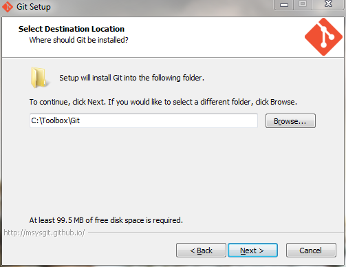

Da wir in der Konsole arbeiten werden, ist es eine gute Idee, schönere Fonts dafür einstellen zu lassen (letzter Punkt):  
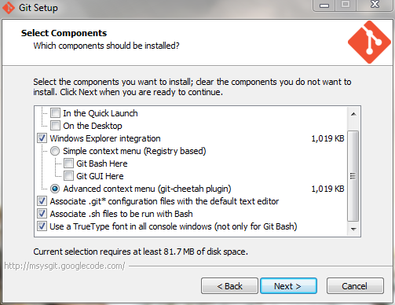

So bleibt das System schön sauber:  
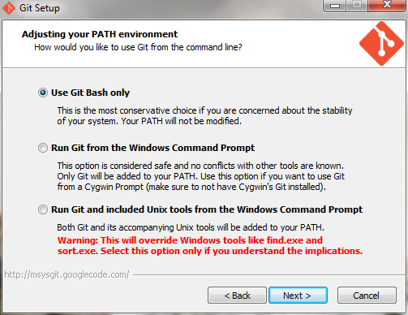

Das ist besonders wichtig, falls man mit anderen zusammenarbeitet, die OS X oder Linux verwenden:  
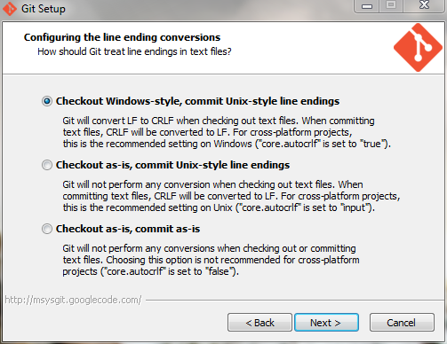

### Terminal

Die Windows-Konsole und Git Bash können geöffnet werden, indem man mit der rechten Maustaste auf eine leere Stelle des Desktops oder eines Explorer-Fensters klickt (für die Windows-Konsole dabei Shift gedrückt halten), dann erscheint ein ähnliches Menü:  
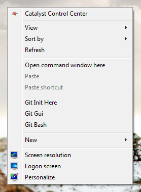  
Die Windows-Konsole befindet sich neben dem Punkt "Einfügen".

Im folgenden (z.B. im Abschnitt [Testen](#test)) wird Git Bash als Terminal bezeichnet.

Eine Administrator-Konsole bekommt man so: Start → `cmd.exe` eingeben → Rechtsklick → Als Administrator ausführen

### Git-Einstellung

Im Terminal (auf Anführungszeichen achten):

    git config --global core.editor "'C:/Toolbox/Notepad++/notepad++.exe' -multiInst -notabbar -nosession -noPlugin"

### Uncertainties

- [Uncertainties](http://pythonhosted.org/uncertainties/): Python-Bibliothek für automatisierte Fehlerrechnung
- `pip install uncertainties` im Terminal eingeben

### Make

- [Make](https://www.gnu.org/software/make/): automatisiert Abläufe
    - [Version 3.81](http://gnuwin32.sourceforge.net/downlinks/make.php)

Auf den Pfad achten:  
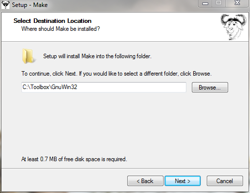

Nach der Installation muss der Pfad in der die `make.exe` liegt (C:\\Toolbox\\GnuWin32\\bin) zum Path hinzugefügt werden:

__Alternative 1__:
`setx PATH "C:\Toolbox\GnuWin32\bin;%PATH%" /m` in einer Administrator-Konsole eingeben.

__Alternative 2__:

- Rechtsklick auf `Computer` -> `Eigenschaften` -> `Erweiterte Systemeinstellungen` -> Umgebungsvariablen
- unter `Systemvariablen` nach `Path` suchen -> Doppelklick
- den Make-Pfad an den Anfang der Liste setzen und mit einem ";" vom nächsten Eintrag trennen
- Beispiel: `C:\Toolbox\GnuWin32\bin;C:\Windows\…`

### TeXLive

- [TeXLive](https://www.tug.org/texlive/): [Installationsanleitung](https://www.tug.org/texlive/windows.html)
    - [Version 2014](http://mirror.ctan.org/systems/texlive/tlnet/install-tl-windows.exe)
    - `install-tl-windows.exe` als Administrator ausführen (mit Rechtsklick)
    - __Achtung__ während des Installationsvorgangs werden ca. 4 GiB Dateien heruntergeladen

Die einfache Installation genügt:  
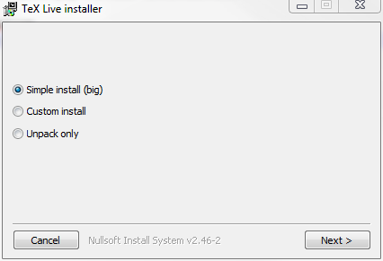

Auf den Pfad achten:  
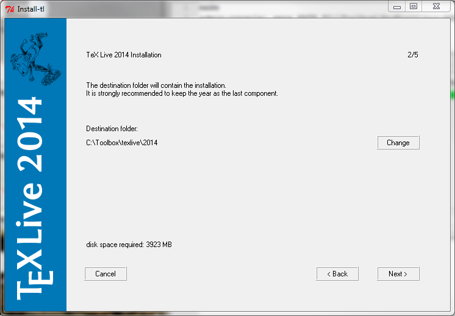

Die Standardeinstellungen sind ok:  
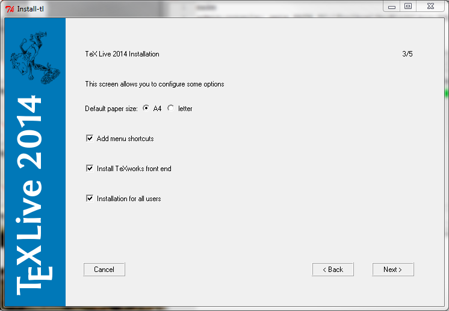

### ConEmu (optional, für erfahrere Nutzer)

Die Windows-Konsole hat einige einschränkungen, vor Allem was Copy+Paste angeht. Deutlich besser geht dies mit ConEmu.

- [ConEmu](https://code.google.com/p/conemu-maximus5/): deutlich bessere Konsole für Windows
    - [Version 140814](http://www.fosshub.com/download/ConEmuSetup.140814.exe)
    - [ConEmu mit Git Bash im Kontext-Menü](http://superuser.com/a/454381)

## <a id="osx"></a>OS X


### Terminal

- Das Terminal sollte in jeder OS X Distribution enthalten sein
- Im Spotlight nach "Terminal" suchen
- Das Programm befindet sich in `Programme/Dienstprogramme/Terminal.app`

### XCode Tools

Die Installation von XCode erfolgt über den AppStore.


Mit XCode sollten die Commandlinetools mit installiert worden sein.
Insbesondere sind darin **Git** und **make** enthalten.
Es kann so überprüft werden, ob die Tools vorhanden sind:
```
$ gcc
```
Wenn alles in Ordnung ist, sollte ein Fehler erscheinen ;-)
```
clang: error: no input files
$
```

### Anaconda

- [Anaconda](http://www.continuum.io/downloads): Python und Bibliotheken
    - Download Anaconda3 [Version 2.0.1 (OS X ≥ 10.7)](http://repo.continuum.io/anaconda3/Anaconda3-2.0.1-MacOSX-x86_64.pkg) (beinhaltet python3, etc.)
    - Paket installieren

### Uncertainties

- [Uncertainties](http://pythonhosted.org/uncertainties/): Python-Bibliothek für automatisierte Fehlerrechnung
- `pip install uncertainties` im Terminal eingeben

### MacTeX

- [MacTeX](https://tug.org/mactex/): Umfassende LaTeX-Distribution
- MacTeX.pkg [herunterladen](http://mirror.ctan.org/systems/mac/mactex/MacTeX.pkg) und das Paket installieren

### Sublime Text (optional)

- [Sublime Text](http://www.sublimetext.com/3) ist ein leichter Texteditor, der durch viele Pakete erweitert werden kann
- Download @ [sublimetext.com](http://c758482.r82.cf2.rackcdn.com/Sublime%20Text%20Build%203065.dmg)
  - Nach dem Download die `.dmg` einbinden und die App installieren
- **Hinweis:** es handelt sich bei diesem Editor um proprietäre Software

## <a id="linux"></a>Linux

Manche Befehle brauchen unter Umständen vorne ein `sudo`.

### Git

- Debian, Ubuntu, Mint:

        (sudo) apt-get install git

- Fedora:

        (sudo) yum install git-core

- OpenSUSE:

        (sudo) zypper in git

- Arch Linux:

        (sudo) pacman -S git

### Python

- [Anaconda](http://www.continuum.io/downloads): Python und Bibliotheken
    - [Version 2.0.1, 32-bit](http://repo.continuum.io/anaconda3/Anaconda3-2.0.1-Linux-x86.sh)
    - [Version 2.0.1, 64-bit](http://repo.continuum.io/anaconda3/Anaconda3-2.0.1-Linux-x86_64.sh)
- Im Terminal:

        bash Anaconda3-2.0.1-Linux-x86_64.sh
        <Enter>
        yes
        ~/.local/anaconda3
        yes

Nach der Installation muss man einen neuen Terminal öffnen, damit Anaconda gefunden wird.

### Uncertainties

    pip install uncertainties

### Make

- Debian, Ubuntu, Mint:

        (sudo) apt-get install make

- Fedora:

        (sudo) yum install make

- OpenSUSE:

        (sudo) zypper in make

- Arch Linux:

        (sudo) pacman -S make

### TeXLive

- [TeXLive](https://www.tug.org/texlive/): [Installationsanleitung](https://www.tug.org/texlive/quickinstall.html)
    - [Version 2014](http://mirror.ctan.org/systems/texlive/tlnet/install-tl-unx.tar.gz)
    - __Achtung__ während des Installationsvorgangs werden ca. 4 GiB Dateien heruntergeladen

Im Terminal:

    tar xvzf install-tl-unx.tar.gz
    TEXLIVE_INSTALL_PREFIX=~/.local/texlive install-tl-*/install-tl
    I
    echo export PATH=\"$(echo ~/.local/texlive/2014/bin/*):\$PATH\" >> ~/.bashrc

## <a id="test"></a>Testen

### Git

Im Terminal:

- `git`
- es sollte die Git-Hilfe erscheinen

Git einstellen: im Terminal (<span style="color: red;">__Eigene Daten eintragen!!!__</span>):

- `git config --global user.name "Max Mustermann"`
- `git config --global user.email "max.mustermann@udo.edu"`

### Python

Im Terminal:

- `ipython`
- `%matplotlib`
- `import matplotlib.pyplot as plt`
- `plt.plot([1, 2, 4])`
- es sollte ein Fenster mit einem Plot erscheinen

### Uncertainties

Im Terminal:

- `ipython`
- `import uncertainties`
- es sollte keine Fehlermeldung erscheinen

### Make

Im Terminal:

- `make`
- es sollte folgende Ausgabe erscheinen:

        make: *** No targets specified and no makefile found.  Stop.

### TeX

Im Terminal:

- `luatex` (mit Strg-C beenden)
- es sollte folgende Ausgabe erscheinen:

        This is LuaTeX, Version beta-0.79.1 (TeX Live 2014) (rev 4971)
         restricted \write18 enabled.
        **

- `biber`
- es sollte die Biber-Hilfe erscheinen
- `texdoc texlive`
- es sollte die Dokumentation von TeXLive geöffnet werden (in einem PDF-Viewer)

TeXLive einstellen: in der Konsole:

- `tlmgr option autobackup -- -1`
- `tlmgr option repository http://mirror.ctan.org/systems/texlive/tlnet`

## <a id="update"></a>Aktualisieren

### Anaconda

Im Terminal:

- `conda update conda`
- `conda update anaconda`

### Uncertainties

Im Terminal:

- `pip install -U uncertainties`

### TeXLive

In der Konsole:

- `tlmgr update --self --all`
