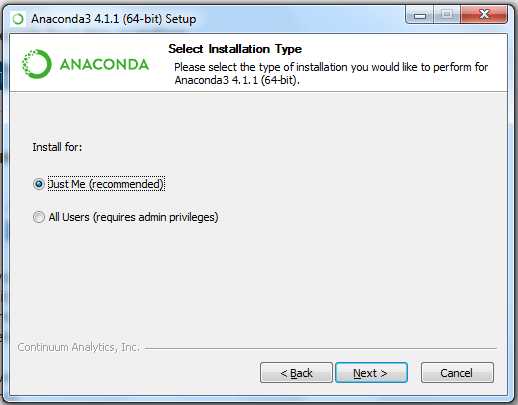
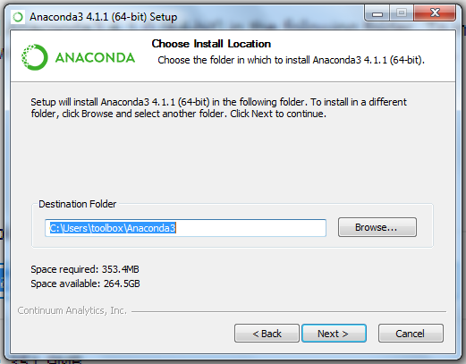
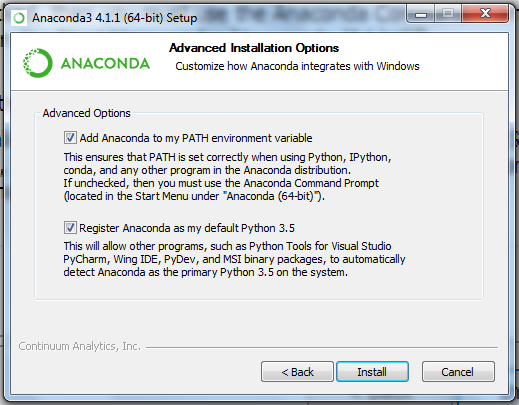
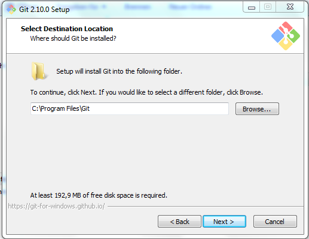
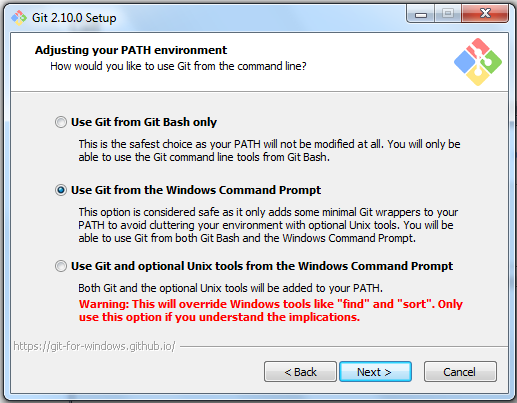
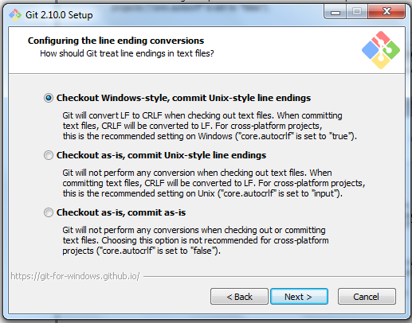
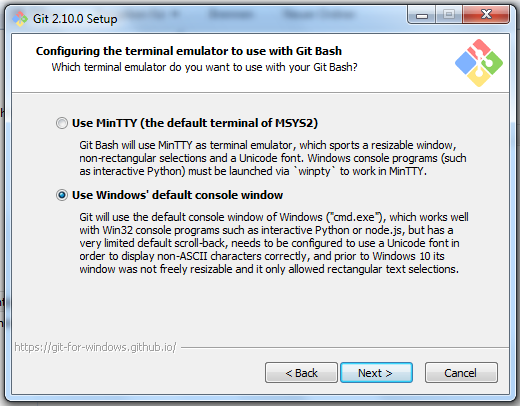
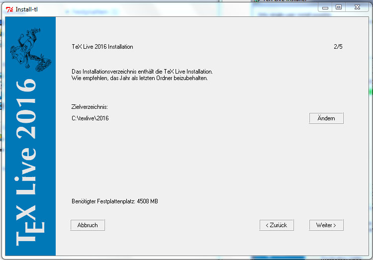
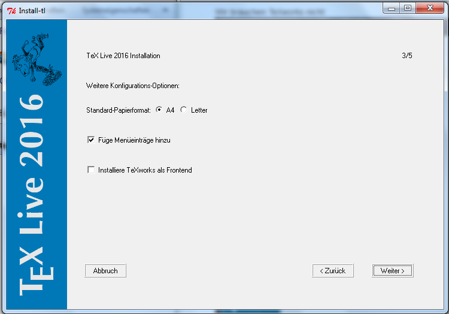

Die Installationsanleitung wurde noch nicht für 2015 aktualisiert.

Wir empfehlen die Installation einer 64-bit Version, falls man ein 64-bit Betriebssystem benutzt.
Wenn man sich nicht sicher ist, hat man heutzutage fast immer 64-bit.

Für OS X und Linux sind Konsole und Terminal gleichbedeutend, für Windows nicht.

__Es müssen alle Schritte (Installieren, Testen, Aktualisieren) ausgeführt werden!__

Falls man nicht am LaTeX-Kurs teilnimmt, ist TeXLive/MacTeX optional.
Dann kann man allerdings kein TeX in matplotlib benutzen (führt zu weniger schönen Plots).

Falls man nur am LaTeX-Kurs teilnehmen will, sollte man mindestens Sumatra und Atom (oder einen anderen Texteditor) und TeXLive/MacTeX installieren.
Dann ist mit Terminal die Windows-Konsole gemeint (wenig bequem).

1. Installieren
    - [Windows](#windows)
    - [OS X](#osx)
    - [Linux](#linux)
2. [Testen](#test)
3. [Aktualisieren](#update)

## Windows

Getestet auf Windows 7, funktioniert wahrscheinlich auch für 8 und 10.

[Dateiendungen einschalten!](https://support.microsoft.com/kb/865219/de)

### Sumatra PDF

- [Sumatra](http://www.sumatrapdfreader.org/download-free-pdf-viewer.html): PDF-Betrachter

Die Verwendung von Acrobat Reader wird nicht empfohlen, da er die PDF-Datei blockiert, sodass sie nicht von TeX überschrieben werden kann (warum das wichtig ist, erfährt man im Kurs).

Unter Options kann er als Standard-Programm für PDFs eingestellt werden:  

### Atom

- [Atom](https://atom.io/): Texteditor

Hier sind Einstellungen weder nötig noch möglich.

### Anaconda

- [Anaconda](http://www.continuum.io/downloads): Python und Bibliotheken

[Hier](https://repo.continuum.io/archive/index.html) die neueste (unten auf der Seite) Version aussuchen.
Richtig ist `Anaconda3-*-Windows-x86_64.exe` für 64-bit und `Anaconda3-*-Windows-x86.exe` für 32-bit.
__Wichtig__: `Anaconda3` und nicht nur `Anaconda` auswählen (wir wollen Python 3).

Die Standardeinstellung ist ok:  

Der Standardpfad ist ok:  

So ist die Verwendung am bequemsten (auch die Standardeinstellungen):  

### ConEmu

- [ConEmu](https://github.com/Maximus5/ConEmu/releases): Mächtiger Ersatz für die Windows-Konsole

Richtig ist die Datei `ConEmuSetup.*.exe`.

Hier `x64` für 64-bit oder `x86` für 32-bit auswählen:  

Die Standardeinstellungen sind ok:  

Einmal ConEmu (vom Desktop oder aus dem Startmenü) starten und die Standardeinstellungen absegnen:  

### Git

- [Git](http://git-scm.com/download/win): Versionskontrolle

Der Standardpfad ist ok:  

Hier "Git Bash Here" und "Associate .sh files to be run with Bash" abwählen:  

So ist git bequem nutzbar:  

Das ist besonders wichtig, falls man mit anderen zusammenarbeitet, die OS X oder Linux verwenden:  

Damit Python auch funktioniert:  

### Unix-Kommandozeilentools und Make

- [MSys2](https://msys2.github.io/): Unix-Kommandozeilentools und Make

`x86_64` ist für 64-bit, `i686` für 32-bit.
Nicht von "Download"-Knöpfen verwirren lassen, Ab-Blocker wird empfohlen.

Der Standardpfad ist ok:  

Das geöffnete schwarze Fenster kann man einfach schließen.

ConEmu starten und über die drei Balken in der rechten oberen Ecke das Einstellungsfenster öffnen:  

Unter "Startup" / "Specified named task" `{Bash::Msys2-*}` auswählen:  

Unter "Integration" die obere Hälfte in die angezeigte Form bearbeiten und dann "Register" drücken (dabei den Eintragsnamen angeben, den man im letzten Schritt ausgewählt hat (für 32-bit)) (gegebenenfalls `Program Files` durch `Programme` oder ähnliches ersetzen):  

Mit "Save settings" unten das Fenster schließen und auch das Hauptfenster schließen.

Jetzt sollte über Rechtsklick auf eine leere Stelle des Desktops oder eines Explorer-Fensters der Eintrag "Bash Here" ConEmu öffnen:  

Ab jetzt ist mit Terminal genau das gemeint.

Jetzt kann Make installiert werden.
Zuerst wird der Paketmanager aktualisiert.
Im geöffneten Terminal eingeben (Rechstklick auf das Terminal zum Einfügen von kopiertem Text):

    pacman -Sy
    pacman --needed -S bash pacman pacman-mirrors msys2-runtime

Jetzt das Terminal neustarten:

    update-core

Falls weitere Pakete aktualisiert wurden, nochmal das Terminal neustarten.
Jetzt werden alle installierten Pakete aktualisiert:

    pacman -Su

Make installieren:

    pacman -S man-db make

Eine Windows-Konsole kann man über ConEmu öffnen:  

### Git-Einstellung

Im Terminal (auf Anführungszeichen achten):

    git config --global core.editor "atom --wait"

### Uncertainties

- [Uncertainties](http://pythonhosted.org/uncertainties/): Python-Bibliothek für automatisierte Fehlerrechnung

Im Terminal eingeben

    pip install uncertainties

### TeXLive

- [TeXLive](https://www.tug.org/texlive/): [Installationsanleitung](https://www.tug.org/texlive/windows.html)
    - [Versionsunabhängiger Link (install-tl-windows.exe)](http://mirror.ctan.org/systems/texlive/tlnet/install-tl-windows.exe)
    - __Achtung__: während des Installationsvorgangs werden ca. 4 GiB Dateien heruntergeladen.
    - Es wird empfohlen, den Virenscanner für die Dauer der Installation abzuschalten, falls es zu Problemen kommt.

Die einfache Installation genügt:  

Der Standardpfad ist ok:  

Wir brauchen TeXworks nicht:  

## OS X

### Terminal

- Das Terminal sollte in jeder OS X Distribution enthalten sein
- Im Spotlight nach "Terminal" suchen
- Das Programm befindet sich in `Programme/Dienstprogramme/Terminal.app`

### XCode Tools

Die Installation von XCode erfolgt über den AppStore:  

Mit XCode sollten die Commandlinetools mit installiert worden sein.
Insbesondere sind darin `git` und `make` enthalten.

### Anaconda

- [Anaconda](http://www.continuum.io/downloads): Python und Bibliotheken

[Hier](https://repo.continuum.io/archive/index.html) die neueste (unten auf der Seite) Version aussuchen.
Richtig ist `Anaconda3-*-MacOSX-x86_64.pkg`.
__Wichtig__: `Anaconda3` und nicht nur `Anaconda` auswählen (wir wollen Python 3).
Das Paket installieren.

### Uncertainties

- [Uncertainties](http://pythonhosted.org/uncertainties/): Python-Bibliothek für automatisierte Fehlerrechnung

Im terminal:

    pip install uncertainties

### MacTeX

- [MacTeX](https://tug.org/mactex/): Umfassende LaTeX-Distribution

[MacTeX.pkg](http://mirror.ctan.org/systems/mac/mactex/MacTeX.pkg) herunterladen und das Paket installieren.

## Linux

### Git und Make

- Debian, Ubuntu, Mint:

        sudo apt-get install git make

- Fedora:

        sudo yum install git-core make

- OpenSUSE:

        sudo zypper in git make

- Arch Linux:

        sudo pacman -S git make

### Anaconda

- [Anaconda](http://www.continuum.io/downloads): Python und Bibliotheken

[Hier](https://repo.continuum.io/archive/index.html) die neueste (unten auf der Seite) Version aussuchen.
Richtig ist `Anaconda3-*-Linux-x86_64.sh` für 64-bit und `Anaconda3-*-Linux-x86.sh` für 32-bit.
__Wichtig__: `Anaconda3` und nicht nur `Anaconda` auswählen (wir wollen Python 3).

Im Terminal:

    bash Anaconda3-*-Linux-*.sh
    <Enter>
    yes
    ~/.local/anaconda3
    yes

Nach der Installation muss man ein neues Terminal öffnen, damit Anaconda gefunden wird.

### Uncertainties

    pip install uncertainties

### TeXLive

- [TeXLive](https://www.tug.org/texlive/): [Installationsanleitung](https://www.tug.org/texlive/quickinstall.html)
    - [Versionsunabhängiger Link (install-tl-unx.tar.gz)](http://mirror.ctan.org/systems/texlive/tlnet/install-tl-unx.tar.gz)
    - __Achtung__ während des Installationsvorgangs werden ca. 4 GiB Dateien heruntergeladen

Im Terminal:

    tar xvzf install-tl-unx.tar.gz
    TEXLIVE_INSTALL_PREFIX=~/.local/texlive install-tl-*/install-tl
    I
    echo export PATH=\"$(echo ~/.local/texlive/*/bin/*):\$PATH\" >> ~/.bashrc

## Testen

### Git

Im Terminal:

    git

Es sollte die Git-Hilfe erscheinen.

Git einstellen: im Terminal (__Eigene Daten eintragen!!!__):

    git config --global user.name "Max Mustermann"
    git config --global user.email "max.mustermann@udo.edu"
    git config --global pull.rebase true
    git config --global rebase.stat true
    git config --global merge.conflictstyle diff3

### Python

Im Terminal:

    ipython
    %matplotlib
    import matplotlib.pyplot as plt
    plt.plot([1, 2, 4])

Es sollte ein Fenster mit einem Plot erscheinen.

### Uncertainties

Im Terminal:

    ipython
    import uncertainties

Es sollte keine Fehlermeldung erscheinen.

### Make

Im Terminal:

    make

Es sollte folgende Ausgabe erscheinen:

    make: *** No targets specified and no makefile found.  Stop.

### TeX

Im Terminal:

    luatex

Es sollte folgende Ausgabe erscheinen:

    This is LuaTeX, Version beta-0.80.0 (TeX Live 2015) (rev 5238)
     restricted \write18 enabled.
    **

Mit Strg-C beenden.

    biber

Es sollte die Biber-Hilfe erscheinen.

    texdoc texlive

Es sollte die Dokumentation von TeXLive geöffnet werden (in einem PDF-Betrachter).

TeXLive einstellen: in der Konsole:

    tlmgr option autobackup -- -1
    tlmgr option repository http://mirror.ctan.org/systems/texlive/tlnet

## Aktualisieren

### Anaconda

Im Terminal:

    conda update anaconda

### Unix-Tools und Make (Windows)

Im Terminal:

    update-core

Falls Pakete aktualisiert wurden, Terminal neustarten.

    pacman -Su

### Uncertainties

Im Terminal:

    pip install -U uncertainties

### TeXLive

In der Konsole:

    tlmgr update --self --all
